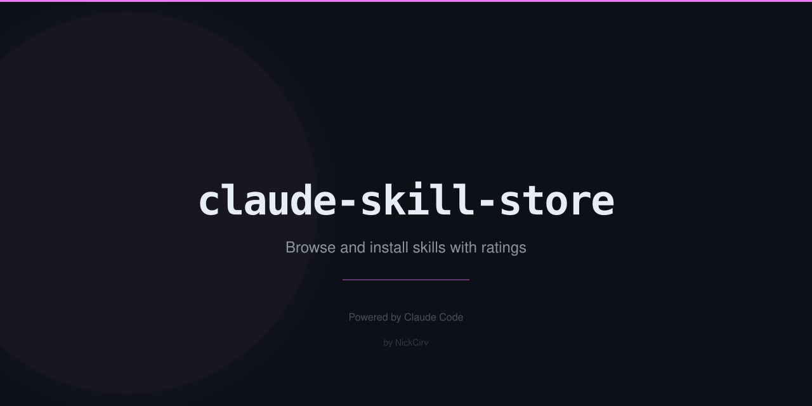

# claude-skill-store

Browse, search, and install Claude Code skills from a curated registry — like npm for AI skills.

<p align="center">
  
  = 18" />
  
</p>

## Why

Claude Code skills extend what Claude can do — RAG pipelines, MCP servers, voice agents, WordPress plugins, Stripe integrations, and more. Finding the right skill used to mean digging through GitHub repos or documentation. `claude-skill-store` gives you a searchable, browsable registry with install counts, author info, and one-command installation.

## Quick Start

```bash
# Search for skills
npx claude-skill-store search rag

# See what's most popular
npx claude-skill-store popular

# Browse by category
npx claude-skill-store categories

# Get full details on a skill
npx claude-skill-store info mcp-server-builder

# Install a skill
npx claude-skill-store install rag-pipeline
```

## What It Does

- Searches skills by name, description, tags, category, or author — all fields indexed
- Shows install counts and star ratings so you can find proven skills fast
- Browses skills by category: AI Engineering, HuggingFace, Web & Frontend, Content & Writing, SEO, Development, Business & Data, and more
- Displays full skill details including repo URL, tags, and description
- Installs by delegating to `npx add-skill <name>` — the standard Claude Code skill installer

## Example Output

```
$ npx claude-skill-store search rag

  Found 3 skills matching "rag"

  rag-pipeline          AI Engineering    4,800 installs   ★312
  Build production RAG systems with document ingestion, chunking, embeddings,
  and retrieval. Supports Chroma, Pinecone, pgvector.
  Tags: rag, embeddings, search, vector-db, llm

  knowledge-graph-rag   AI Engineering    1,200 installs   ★89
  GraphRAG implementation — combine knowledge graphs with LLM retrieval.
  Tags: graphrag, knowledge-graph, neo4j, llm, rag

  web-scraping-ai       AI Engineering    2,100 installs   ★156
  Web scraping with AI — Firecrawl, structured extraction, content pipelines.
  Tags: scraping, firecrawl, extraction, web, rag


$ npx claude-skill-store categories

  AI Engineering          12 skills
  Content & Writing       18 skills
  Development             14 skills
  HuggingFace              8 skills
  Business & Data          9 skills
  Web & Frontend           6 skills
  SEO                      3 skills
```

## Commands

### `search <query>`

Search by keyword across name, description, tags, category, and author.

### `popular`

Show the most installed skills.

| Option | Description | Default |
|--------|-------------|---------|
| `-n, --limit <number>` | Number of results to show | `10` |

### `categories`

List all categories with skill counts, or filter to a single category.

| Option | Description |
|--------|-------------|
| `-c, --category <name>` | Show skills in a specific category |

### `info <skill>`

Show full details for a skill — description, repo, tags, install count, author.

### `install <skill>`

Install a skill via `npx add-skill`. Requires the Claude Code skill ecosystem.

### `list`

List every skill in the registry.

## Install Globally

```bash
npm i -g claude-skill-store
```

## License

MIT
